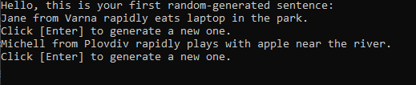

# Random Sentence Generator
***

This code generates random sentences using arrays of names, places, verbs, nouns, adverbs, and details. The sentence structure is as follows: **[Name]** from **[Place]** **[Adverb]** **[Verbs]** **[Noun]** **[Details]**.

## 1. Variables

The code defines the following arrays:

- **'names'**: An array of names.

- **'places'**: An array of places.

- **'verbs'**: An array of verbs.

- **'nouns'**: An array of nouns.

- **'adverbs'**: An array of adverbs.

- **'details'**: An array of additional details.

## 2. Function: GetRandomWord

The **'GetRandomWord'** function takes an array of words as an input and returns a randomly selected word. The function uses the Random class to generate a random index for the array, and then returns the word at that index.

## 3. Main Program Flow

### The code outputs an infinite loop of randomly generated sentences. To generate a new sentence, the user must press the [Enter] key.

 The following steps are performed to generate each sentence:

1. Call the **'GetRandomWord'** function for each of the arrays **'names'**, **'places'**, **'verbs'**, **'nouns'**, **'adverbs'**, and **'details'** to get a randomly selected word.

2. Store the selected words in variables **'randomName'**, **'randomPlaces'**, **'randomVerbs'**, **'randomNouns'**, **'randomAdverbs'**, and **'randomDetails'**, respectively.

3. Build the sentence using string interpolation.

4. Output the generated sentence and prompt the user to press **[Enter]** to generate a new one.

## Example Usage

